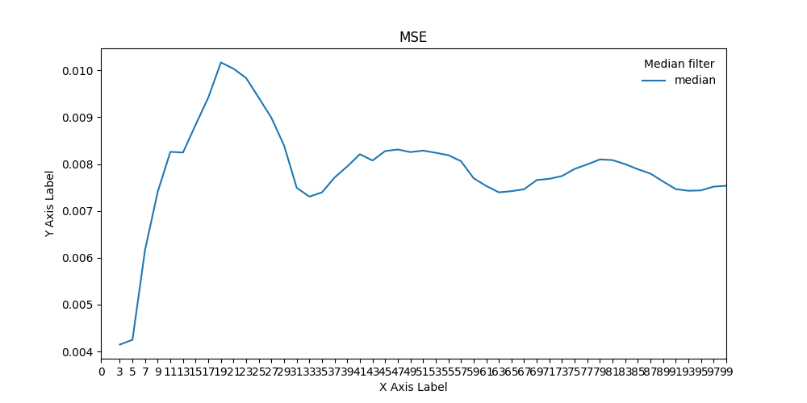
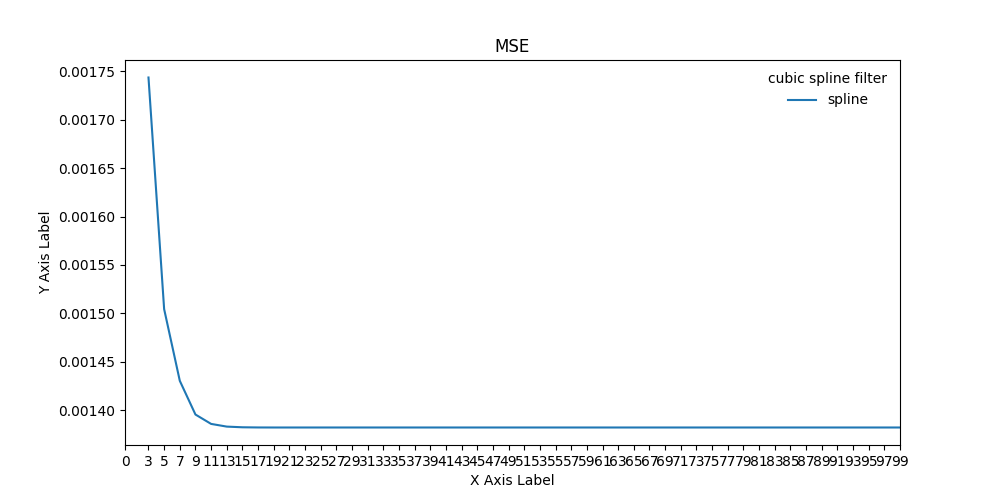
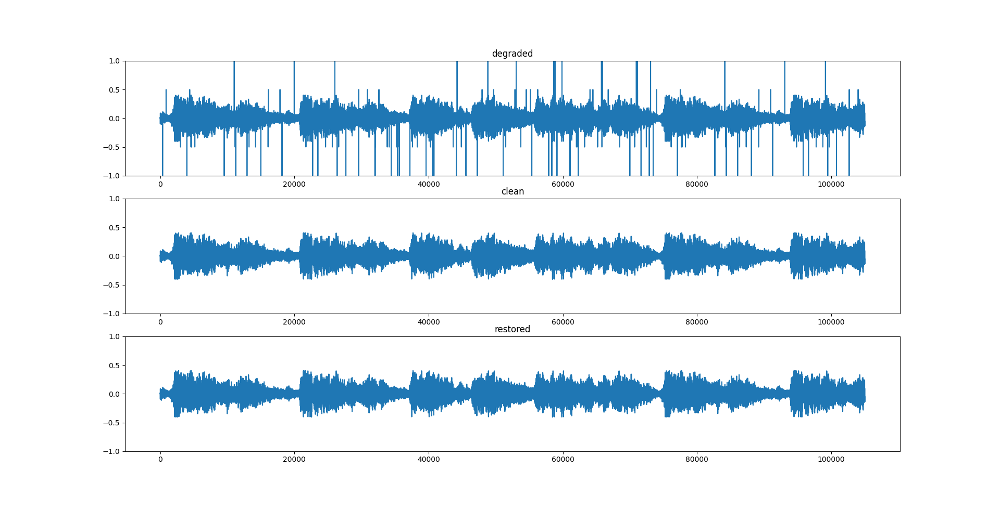
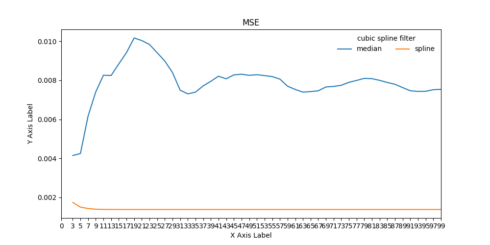

# Assignment 2  Audio Restoration using Python

## High-level Description of the project
This assignment builds on Assignment I. We assume that we have successfully detected the clicks and we are applying different interpolation methods to restore the audio, including
- median filtering
- cubic splines

## Installation and Execution
This assignment build with python 3.12.0, contains libraries as below:  
- matplotlib==3.8.2  
- numpy==1.26.2  
- scipy==1.11.4  
- tqdm==4.66.1  

One easy way to do it is to do that automatically:
```sh                                 
pip3 install pipreqs

pipreqs $project/requirements.txt
```

Afer installing all required packages you can run the demo file simply by typing:
```sh
python demo.py
```
---

## Methodology and Results
Describe here how you have designed your code, e.g. a main script/routine that calls different functions, is the unittesting included in the main routine? 
Functions were defined at top   
- Medain(): return the medain value of the array.  
- spline(): return the interpolation value using cubic spline method.  
- median_filter(): processing the entire audio using medain method.  
- cubic_spline_filter(): processing the entire audio using cubic spline method.  
- MSE(): compute MSE between the interpolated signal and clean audio (only for clicks).  
- test(): test performance for median filter and spline filter by calculate mse using different window length. Also plot the figure of the mse.  

**Task 1**  
Task 1 is to get the restored audio by using median method.
There are two functions for task 1.
A Medain function which is to get the medain value of an array.(not use the np.median()).
And a median_filter function which is used to call and applicate the Medain function to entire signal.
The Medain function has an input of an array and return the medain value.
The medain_filter function has three input -- degraded signal, detection array and window length.
To get the restored signal, we only need to call median_filter function, and it would return the restored signal.

**Task 2**  
Task 1 is to get the restored audio by using cublic splines method.
There are also two function for task 2.
A Spline function to get the interpolation of the array.
A cubic_spline_filter which find the clicks according to the detection array and call the Spline function at these positions.
The Spline function has an input of an array and a window length, returns the interpolation value.
The cucubic_spline_filter function has the same input as the median_filter funciton, and we can also get the restored signal by calling this function.

**Test performance**  
In this project, Mean square error(MSE) is used for test the performance of above two methods. The MSE function has been defined before the main program.
The test() function is defined to show the show the difference of MSE of the two methods with different window length.

**Unittest**  
The unittest is applicated in this project, to validate the performance of the Medain function, compared with the library function np.medain.

**Results**  

1. For the median filter, different lengths were explored to test the effectiveness of the restoration. In particular, 50 points were tested and length=3 was observed to deliver the lowest MSE, as shown in the figure below.  

 

The restored waveform <output_medianFilter.wav> with the optimal filter length is given below:  

 

2. Using the cubic splines, we observe that the overall trend is downward with the decrease of window length.  



The restored waveform <output_cubicSplines.wav> with the optimal filter length is given below (it seems similar than median filter, but it is actully a different method and have lower MSE):  



3. Comparing the two different interpolation methods, we notice that cubic spline method achieves a lower MSE. The runtime of cubic spline method is 0.00052(0.026s/50times)

After listening to the two restored files, we notice that both method has restored the audio successfully, but the spline has a better performance, the best window length is 21, the lowest mse is 0.0013823992500444158. For median filter the best window length is 3, the lowest mse is 0.00414724701515107  



---
## Credits

This code was developed for purely academic purposes by xuzhesong as part of the module computational methods

Resources:
- Slides of EEP5C22 Computational Methods (mainly lecture 6&7)
- https://docs.python.org/3/library/unittest.html
- https://www.freecodecamp.org/news/how-to-write-a-good-readme-file/
- https://docs.github.com/en/get-started/writing-on-github/getting-started-with-writing-and-formatting-on-github/basic-writing-and-formatting-syntax
- https://numpy.org/doc/stable/user/quickstart.html


